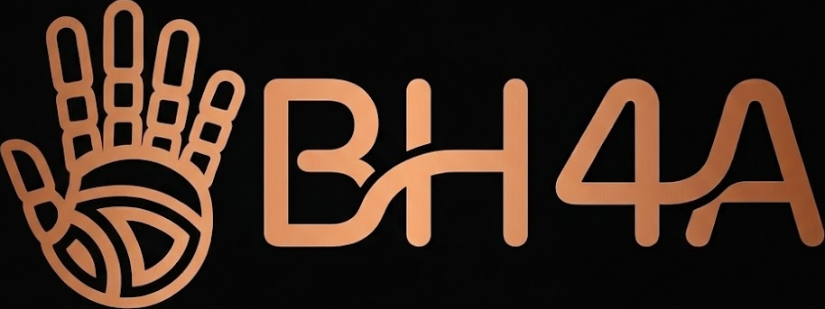

# Bionic Hand For All

A functional, low-cost EMG-controlled bionic hand prosthesis.

> ⚠️ **Legal Notice:** By downloading, cloning, forking or using
> any file in this repository, you automatically accept the terms
> in [PRODUCTION_TERMS.md](PRODUCTION_TERMS.md). Read before use.

  

---

## The Problem

Myoelectric prosthetic hands cost between $5,000 and $70,000 USD.
For most people in Argentina and across the developing world,
that price means no prosthesis at all.

This project is my answer to that.

---

## What This Is

A fully functional bionic hand prosthesis controlled by
electromyographic (EMG) signals, built for under $200 USD,
designed to be replicated by anyone with access to a 3D printer,
basic electronics tools and some lathe machining.

The finished prosthesis will be donated free of charge to a person
in need.

---

## Technical Overview

| Subsystem | Solution |
|---|---|
| Signal capture | Custom AD620-based EMG circuit |
| Processing | ESP32 microcontroller |
| Actuation | MG996R servo motors + tendon system |
| Structure | 3D printed PETG |
| Grip modes | 6 predefined + user-customizable |

### Manufacturing Methods

This project combines digital fabrication with traditional machining:

- **3D printing (FDM)** — Main structural components in PETG
- **Lathe machining** — Custom steel pins and rings for finger
  joints, manufactured at the school's workshop
- **PCB fabrication** — Planned via CNC laser engraving
- **Hardware** — E-clip retainers for joint assembly,
  elastic fabric straps for arm attachment

### Target User

Designed for **transradial upper limb amputees**
(below-elbow amputation).

---

## Project Status

| Phase | Description | Status |
|---|---|---|
| 1 | Planning & organization | ✅ Complete |
| 2 | Specialist consultation & patient selection | 🔵 In progress |
| 3 | PCB design & component sourcing | 🔵 In progress |
| 4 | 3D modeling & initial firmware | ⏳ Upcoming |
| 5 | Prototype testing & iteration | ⏳ Upcoming |
| 6 | Final assembly & programming | ⏳ Upcoming |

---

## About This Project

This is my final year thesis project at the
**Escuela Industrial Domingo Faustino Sarmiento (EIDFS)**,
San Juan, Argentina. I am 18 years old and studying to become
a certified electronics technician.

The idea came from watching a man with both arms amputated
below the elbow struggle to open a bus window. I decided
that accessible technology should mean exactly that — accessible.

**Author & Project Lead:** Juan Manuel Zumel González
**Technical Contributors:** José Ignacio Amato, Gaspar Uñates

---

## Repository Structure

| Folder | Contents |
|---|---|
| `/docs` | Technical documentation and project brief |
| `/hardware` | Schematics and PCB files |
| `/firmware` | ESP32 code |
| `/mechanical` | 3D models and STL files |
| `/research` | Literature review and investigation notes |
| `/institutional` | Laboratory proposal documents |
| `/media` | Photos, videos and demos |

---

## License

| Component | License |
|---|---|
| Firmware and software | [MIT License](LICENSE) |
| Hardware designs, schematics and 3D models | [CC BY-NC-SA 4.0](LICENSE-HARDWARE) |
| Documentation, research and media | [CC BY 4.0](LICENSE-DOCS) |
| Physical production terms | [PRODUCTION_TERMS.md](PRODUCTION_TERMS.md) |
